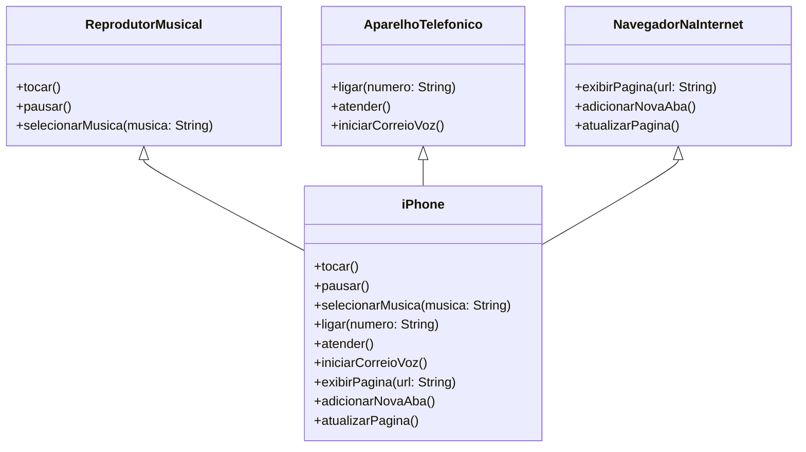

```mermaid
classDiagram
    class ReprodutorMusical {
        +tocar()
        +pausar()
        +selecionarMusica(musica: String)
    }

    class AparelhoTelefonico {
        +ligar(numero: String)
        +atender()
        +iniciarCorreioVoz()
    }

    class NavegadorNaInternet {
        +exibirPagina(url: String)
        +adicionarNovaAba()
        +atualizarPagina()
    }

    class iPhone {
        +tocar()
        +pausar()
        +selecionarMusica(musica: String)
        +ligar(numero: String)
        +atender()
        +iniciarCorreioVoz()
        +exibirPagina(url: String)
        +adicionarNovaAba()
        +atualizarPagina()
    }

    ReprodutorMusical <|-- iPhone
    AparelhoTelefonico <|-- iPhone
    NavegadorNaInternet <|-- iPhone
```
